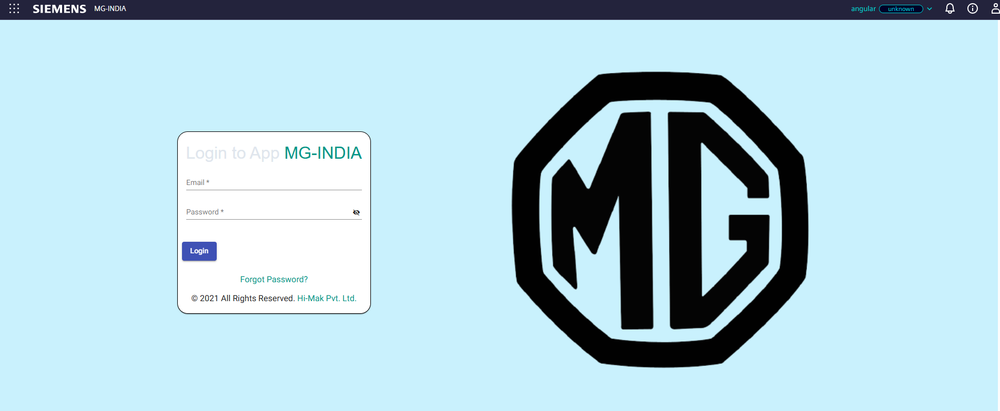

<div align="center">

# 🚀 Hey there! I'm a Code Wizard ✨

### _Building the future, one commit at a time_ 💻

---

## 🔥 **What I'm About**

```
🎯 Full-Stack Developer | 🤖 AI Enthusiast | 🌐 Web3 Explorer
```

**Currently vibing with:** `Angular` `Node.js` `Python` `TypeScript` `Solana`

</div>

---

## 💫 **FEATURED PROJECTS**

### 🏭 **MG Hector Production Dashboard**

> _When IoT meets real-world manufacturing_ 🦾

<a href="https://angular-mm.web.app/login">
  
</a>

**🛠️ Tech Stack:** `Angular` `Node.js` `MindSphere` `Node-RED` `MSSQL`
**🌐 Live Demo:** [angular-mm.web.app](https://angular-mm.web.app/login)
_🔒 NDA Protected - Sample demo available_

---

### 🤖 **STRADDL3 - AI Trading Bot**

> _Making crypto markets my playground_ 📈💰

<a href="https://github.com/yashsm01/TreadBot">
  
</a>

**🛠️ Tech Stack:** `Python` `Solana` `Next.js` `PostgreSQL` `Telegram Bot`
**📱 GitHub:** [TreadBot Repository](https://github.com/yashsm01/TreadBot)

_This bot doesn't just trade - it DOMINATES_ 💪

---

### 🛒 **Microservice E-Commerce Empire**

> _Scalability? We don't know her_ ♾️

<a href="https://github.com/Microservices2102/E-Commerce">
  
</a>

**🛠️ Tech Stack:** `Docker` `Kafka` `Node.js` `TypeScript` `Next.js`
**🔗 GitHub:** [E-Commerce Repository](https://github.com/Microservices2102/E-Commerce)

_Breaking monoliths since day one_ 💥

---

### 🔗 **TrustTags - Supply Chain Revolution**

> _Enterprise-level trust, delivered_ 🏢

**🛠️ Tech Stack:** `TypeScript` `Microservices` `Electron` `Node.js`
**🏢 Organization:** [Microservices2102](https://github.com/orgs/Microservices2102/repositories)

**📦 System Architecture:**

- L5: Government Portals (Global) 🌍
- L4: Master Web Server 🖥️
- L3: Local Middleware 🔄
- L2: Desktop Print App 🖨️

_🔒 Enterprise-grade, naturally_

---

<div align="center">

## 🎯 **Let's Connect & Build Something Insane**

[](https://github.com)
[](https://linkedin.com/in/yash-modi-748817190/)
[](https://x.com/yashsm21)

### _"Code is poetry, and I'm writing epics"_ 📝✨

</div>
